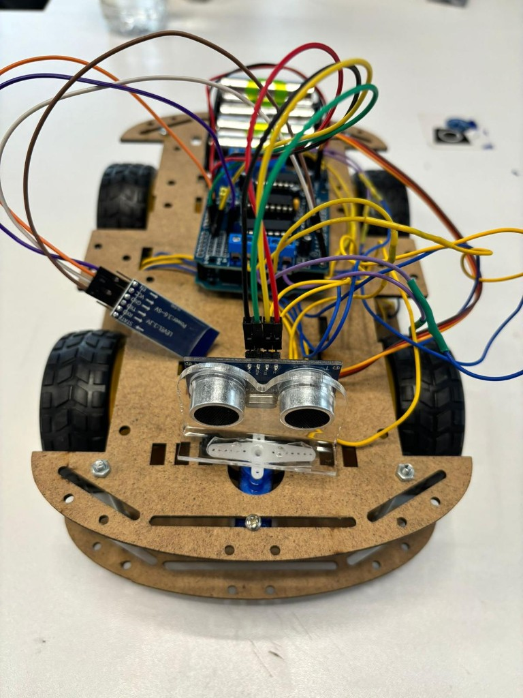

# One Robot, Endless Possibilities  
### Speak · Control · Avoid

<p align="center">
  
</p>

<p align="center"><em>Sir Avoids-a-Lot — multi-mode Arduino robot platform</em></p>

---

## Overview

**One Robot, Endless Possibilities** is a four-wheel Arduino robot designed around three operating modes on a single chassis:

| Mode | What it does |
|------|----------------|
| **Speak** | Accepts voice commands from a phone and drives accordingly |
| **Control** | Manual Bluetooth remote control for precise movement |
| **Avoid** | Autonomous navigation with ultrasonic sensing and obstacle bypass |

When a serial/Bluetooth command is available, the robot follows human input. When idle, it switches to autonomous obstacle avoidance—scanning left and right with a servo-mounted ultrasonic sensor and turning toward the clearer path.

---

## Features

- Voice and Bluetooth control over a shared serial command set  
- Real-time obstacle detection with HC-SR04 ultrasonic sensing  
- Servo-based left/right environment scanning  
- Four-motor differential drive via Adafruit Motor Shield  
- Seamless handoff between manual control and autonomy  

---

## Hardware

| Component | Role |
|-----------|------|
| Arduino Uno | Main controller |
| Adafruit Motor Shield (`AFMotor`) | Drives 4× DC motors |
| HC-SR04 ultrasonic sensor | Distance measurement (`TRIG` → A1, `ECHO` → A0) |
| Servo (pin D9) | Rotates the ultrasonic sensor for scanning |
| HC-05 / HC-06 Bluetooth module | Wireless voice & remote commands |
| 4× DC motors + wheels | Locomotion |
| AA battery pack | Onboard power |

<p align="center">
  
</p>

<p align="center"><em>Circuit diagram</em></p>

---

## Firmware

Open [`one-robot-speak-control-avoid.ino`](one-robot-speak-control-avoid.ino) in the Arduino IDE.

### Required libraries

- `Servo` (built into Arduino IDE)
- [Adafruit Motor Shield library](https://github.com/adafruit/Adafruit-Motor-Shield-library) (`AFMotor`)

### Serial / Bluetooth commands

| Command | Action |
|---------|--------|
| `F` or `^` | Forward |
| `B` or `-` | Backward |
| `L` or `<` | Turn left |
| `R` or `>` | Turn right |
| `S` or `*` | Stop |

### Autonomous behavior

If no command is received and an obstacle is detected within **12 cm**, the robot:

1. Stops and reverses briefly  
2. Scans left and right with the servo  
3. Turns toward the side with more free space  
4. Continues forward  

---

## Demo media

| File | Description |
|------|-------------|
| `Bluetooth Control.mp4` | Manual Bluetooth driving |
| `voice commands (Left & Right).mp4` | Voice left/right control |
| `Forward command.mp4` | Forward voice/command demo |
| `backward and stop commands.mp4` | Backward and stop |
| `obstacle avoidance.mp4` | Autonomous avoidance |
| `servo check.mp4` | Servo scan verification |

Project report: [`Project_Stage3.pdf`](Project_Stage3.pdf) · [`Project_Stage3.docx`](Project_Stage3.docx)

---

## Repository layout

```
one-robot-speak-control-avoid/
├── one-robot-speak-control-avoid.ino   # Main firmware
├── README.md
├── Sir-Avoids-a-Lot.png                # Robot photo
├── The circuit diagram.png
├── Project_Stage3.pdf / .docx
└── *.mp4                               # Demo videos
```

---

## Getting started

1. Assemble the hardware as shown in the circuit diagram.  
2. Install the Adafruit Motor Shield library in the Arduino IDE.  
3. Upload `one-robot-speak-control-avoid.ino` to the Arduino Uno.  
4. Pair your phone with the Bluetooth module.  
5. Send movement commands, or leave the robot idle to enable avoidance mode.

---

<p align="center">
  <strong>One robot. Three modes. Endless possibilities.</strong>
</p>
